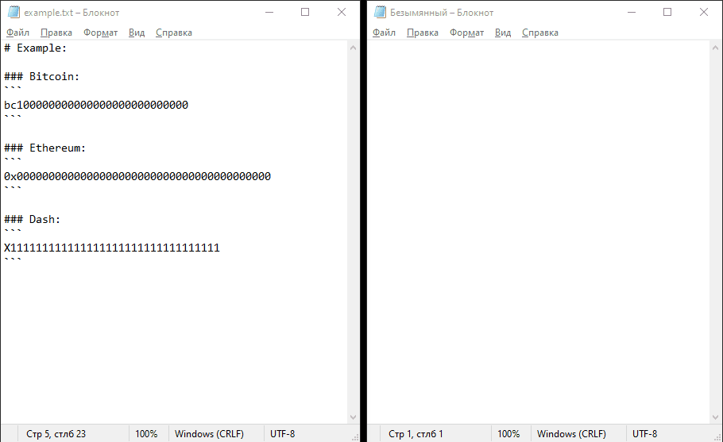

# crypto-yank-go

### Note:
This is the implementation of the jacques-andre [crypto-yank](https://github.com/jacques-andre/crypto-yank/) in Go language. Check his [blog](https://www.jacquesandre.me/posts/crypto-yank/) to learn more.
## Preview:
</img>

## About/Usage:

### About:
`crypto-yank-go` uses regular expressions to find and replace cryptocurrency address in the user clipboard.

### Usage:
```
go get ./...
go build
./crypto-yank-go
```

Replace `replace_me` strings with your own values. Use empty `""` string for currencies, that you don't want to replace.

**Example:**
```
master_addresses := map[string]string{
  "btc":  "replace_me_btc",
  "xmr":  "",
  "eth":  "replace_me_eth",
  "dash": "",
  "xrp":  "",
  "doge": "replace_me_doge",
  "ada":  "",
  "lite": "",
  "tron": "",
}
```

In this case `crypto-yank-go` will only replace Bitcoin, Ethereum and Doge addresses.

## Supported Coins:
- Bitcoin (`$BTC`)
- Dash (`$DASH`)
- Ethereum (`$ETH`)
- Monero (`$XMR`)
- Litecoin (`$LTC`)
- Cardano (`$ADA`)
- Doge (`$DOGE`)
- Ripple (`$XRP`)
- Tron (`$TRX`)

### Warning:
This is a proof of concept. This tool is not intended to be used for illegal and/or malicious purposes. I am not responsible for any damage you cause while using this tool.
